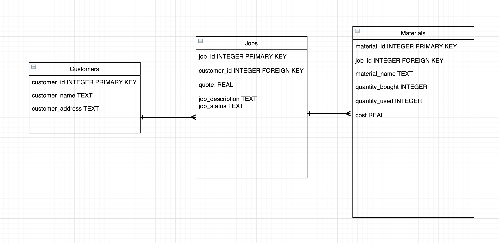

# Builder / Handy Person App

This app is based on the following challenge:

> Design a system for a builder/handy-person who does a range of jobs.
> They only buy materials once a job is in progress, and when a job is complete they are able to sell back un-used materials.
> The first step in designing an application is to create the ERD should have the following entities:
>    - customer: has all details required to invoice a customer and contact them by telephone and over the internet. 
>    - jobs: each job is based on a quote $, and has a description of the work involved, and a job status which has three values: quoted, quote accepted, in progress, and complete. 
>    - materials: individual consumable items used to do jobs, assume that materials are bought only for a specific job, materials must have a cost per unit, the quantity bought, quantity used.

## ERD

* One customer to many jobs
* One job to many materials

## Features

* database functions to insert records for different entities split into separate files
* `data.js` demonstrates chaining of promises to create database records which have relationships using a foreign key
